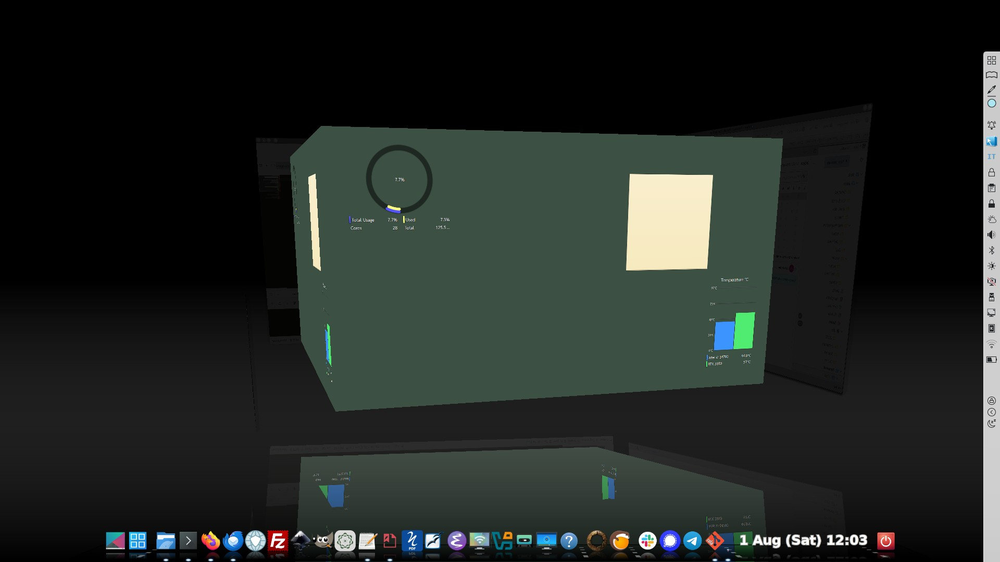

# Static Dock Plugin for Compiz


A standalone, independently buildable/installable Debian package for the
`staticdock` compiz plugin - keeps panel/dock windows flat, undistorted,
and fully opaque while cube, rotate, or expo transform the desktop,
instead of shrinking/rotating/fading them along with everything else.

This plugin was inspired by similar effects in KDE. Its two-pass rendering approach was inspired by Mark Thomas's static.c plugin for Compiz 0.8, but was independently reimplemented for Compiz 0.9.x using the GLScreenInterface and GLWindowInterface APIs.



## Building

These instructions are tested in Ubuntu 26.04. If you have a different distro,
instructions may need to be adapted.

Install building dependencies first

```shell
sudo apt install devscripts build-essential
sudo apt build-dep .   # or just: sudo mk-build-deps -i debian/control
```

### Debian package

```shell
dpkg-buildpackage -us -uc -b
```

This produces `../compiz-plugin-staticdock_0.1.0-1_amd64.deb` (a prebuilt
copy for this exact package version is included alongside this source).

### Or just compiling

```shell
mkdir build
cd build
cmake .
make
```

## Installing

Installing in Ubuntu

```shell
sudo dpkg -i ./compiz-plugin-staticdock_0.1.0-1_amd64.deb
```

Restart compiz if necessary. Then enable "Static Dock" in CCSM.

## Uninstalling

```
sudo apt remove compiz-plugin-staticdock
```

Verified clean in both directions - nothing lingers outside the package
manifest.
